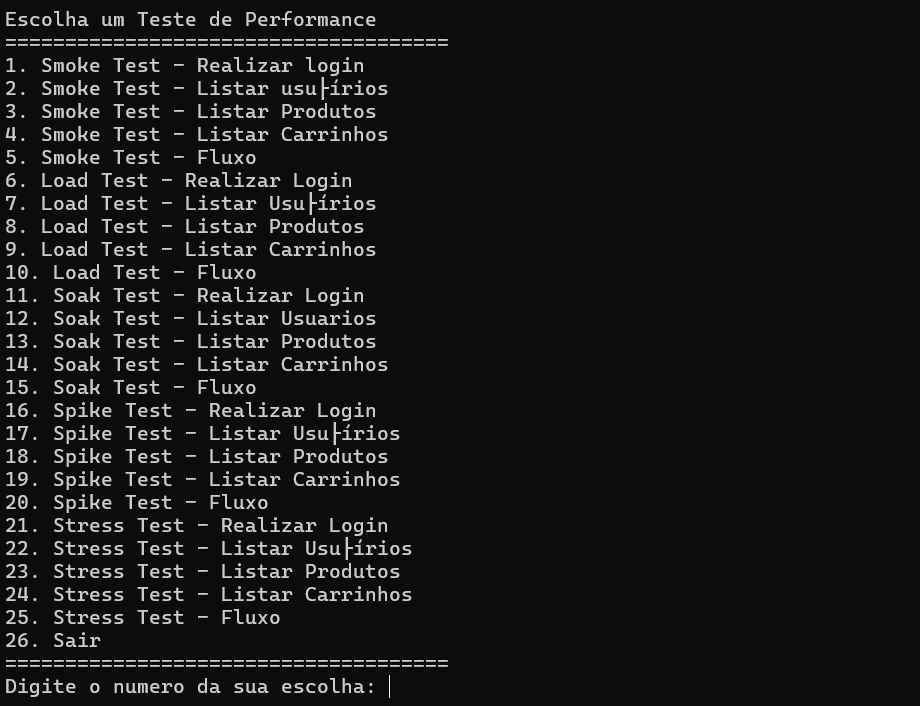
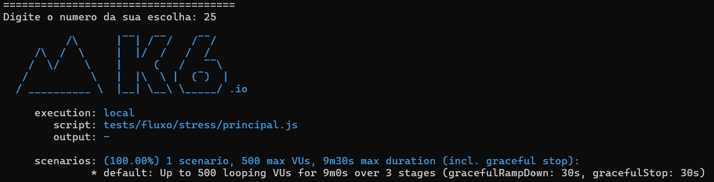

# AWS For Software Quality e Test Automation

 
## Indice
- [Autor](#autor)
- [ServeRest](#serverest)
  - [Dependências](#dependências)
    - [Visual Studio Code](#vs-code)
    - [Git](#git)
    - [Node.js](#nodejs)
    - [NPM](#npm)
    - [Postman](#postman)
    - [K6](#k6)
  - [Instalação](#instalação)
  - [Endpoints](#endpoints)
  - [Exemplo de testes automatizados](#exemplo-de-testes-automatizados)
  - [Testes no K6](#testes-no-k6)
- [Calculadora](#calculadora)
  - [Dependências](#dependências-1)
    - [Visual Studio Code](#vs-code-1)
    - [Git](#git-1)
    - [Node.js](#nodejs-1)
    - [NPM](#npm-1)
    - [Mocha](#mocha)
    - [Chai](#chai)
  - [Instalação](#instalação-1)
  - [Métodos robustos](#métodos-robustos)
  - [testes](#testes)
  - [Nome das variáveis e métodos](#nome-das-variáveis-e-métodos)
## Autor

<a href="https://www.linkedin.com/in/joão-moura-7ab135209">
 
  
 <b>João Paulo de Moura</b></a> 
  

## ServeRest
Para quem está começando em testes de API, a Serverest é uma ferramenta **essencial**. Ela oferece um ambiente **pronto e fácil de usar** para simular um e-commerce real, com endpoints completos e diversos cenários para testar. Com a Serverest, você pode **praticar seus conhecimentos** de testes de API, **explorar diferentes métodos HTTP** e **entender como funcionam as APIs** de forma prática e intuitiva. 

### Dependências

#### VS Code
Para instalar o Visual Studio Code, siga estes passos:

1. Acesse o site oficial do [Visual Studio Code](https://code.visualstudio.com/Download).
2. Clique no botão de download para a versão do seu sistema operacional (Windows, macOS ou Linux).
3. Após o download, abra o arquivo de instalação e siga as instruções na tela.
4. Durante a instalação, você pode escolher o local de instalação e se deseja criar um atalho na área de trabalho.
5. Após a instalação, abra o Visual Studio Code e comece a usar!

#### Git
Para instalar o Git, você pode seguir estes passos:

1. Acesse o site oficial do [Git](https://git-scm.com/download) e faça o download do instalador para o seu sistema operacional.
2. Execute o arquivo de instalação e siga as instruções na tela.
3. Durante a instalação, você pode escolher as opções que deseja, como o editor de texto padrão e o local de instalação.
4. Após a instalação, abra o prompt de comando ou terminal e digite `git --version` para verificar se o Git foi instalado corretamente.

#### Node.js
Para instalar o Node.js, você pode seguir estes passos:

1. Acesse o site oficial do [Node.js](https://nodejs.org/pt).
2. Baixe o instalador **.msi** para o seu sistema operacional **Windows**.
3. Execute o instalador e siga as instruções na tela.
4. Durante a instalação, você pode escolher o local de instalação e se deseja adicionar o Node.js ao **PATH** do sistema.
5. Após a instalação, abra o **prompt de comando** ou o **terminal** e digite **node -v** para verificar se a instalação foi bem-sucedida.

#### NPM
O NPM já vem instalado junto com o Node.js, então você não precisa instalá-lo separadamente! 

#### Postman
Para instalar o Postman, você pode seguir estes passos:

1. Acesse o site oficial do [Postman](https://www.postman.com/downloads/) e faça o download da versão para o seu sistema operacional.
2. Execute o arquivo de instalação e siga as instruções na tela.
3. Após a instalação, abra o Postman e faça login ou crie uma conta gratuita.

#### K6
Para instalar o K6, você pode seguir estes passos:

1. Abra o Windows PowerShell.
2. Execute o comando `winget install k6 --source winget`.

### Instalação
Para instalar e configurar a api Serverest, você pode seguir estes passos:
1. Clonando o repositório do Serverest:
- Obtenha o link do repositório: Acesse o repositório do [Serverest](https://github.com/ServeRest/ServeRest) no GitHub, clique em code e depois em copiar.

- Clone o repositório: Abra o terminal e navegue até o diretório onde deseja clonar o projeto. Execute o seguinte comando, substituindo <link-do-repositorio> pelo link real do repositório:
~~~bash
git clone <link-do-repositorio>
~~~

2. Instalando as dependências do projeto:
- Navegue até o diretório do projeto: No terminal, use o comando cd para navegar até o diretório do projeto clonado.
- Instale as dependências: Execute o seguinte comando:
~~~bash
npm install
~~~
- Isso irá baixar e instalar todas as dependências do projeto.

3. Iniciando a API localmente:

- Execute a API: Execute o seguinte comando no terminal:
~~~bash
npm start
~~~
- Isso irá iniciar a API do Serverest localmente.
- Acesse a API: Abra o navegador e acesse o endereço que foi exibido no terminal (provavelmente algo como http://localhost:3000). Você verá a página inicial da API.

4. Importando a documentação do Swagger no Postman:

- Baixe o arquivo swagger.json: Acesse o repositório do Serverest no GitHub e navegue até a pasta docs. Baixe o arquivo swagger.json.
- Instale o Postman: Se você ainda não o fez, baixe e instale o Postman.
- Importe o arquivo swagger.json: Abra o Postman e clique em "Import". Selecione o arquivo swagger.json que você baixou.
- Explore a documentação: As coleções do Swagger serão importadas para o Postman. Você pode explorar a documentação da API e começar a fazer suas requisições.

### Endpoints
**Login:**

* **Endpoint:** `/login`
* **Método:** POST
  * **Parâmetros:**
    * `email` (string): E-mail do usuário.
    * `senha` (string): Senha do usuário.
  * **Resposta:**
    * **Sucesso:** Retorna um token de autenticação para acesso à API.
    * **Erro:** Retorna um código de erro e uma mensagem descritiva (ex: "Usuário ou senha inválidos").

**Usuários:**

* **Endpoint:** `/usuarios`
* **Métodos:**
    * **POST (Criar Usuário):**
        * **Parâmetros:**
            * `nome` (string): Nome completo do usuário.
            * `email` (string): E-mail do usuário.
            * `senha` (string): Senha do usuário.
            * `administrador` (bool): verdadeiro ou falso.
        * **Resposta:**
            * **Sucesso:** Retorna o ID do usuário recém-criado.
            * **Erro:** Retorna um código de erro e uma mensagem descritiva (ex: "E-mail já cadastrado").
    * **GET (Listar Usuários):**
        * **Parâmetros:** (opcional)
            * `_id` (string): Filtra usuários pelo id.
            * `nome` (string): Filtra usuários pelo nome.
            * `email` (string): Filtra usuários pelo email.
            * `senha` (string): Filtra usuários pela senha.
            * `administrador` (string): Filtra usuários administradores ou não.
        * **Resposta:** Retorna uma lista de usuários com seus IDs, nomes, emails, senhas e se é administrador ou não.
    * **GET (Buscar Usuário por ID):**
        * **Parâmetros:**
            * `id` (int): ID do usuário a ser buscado.
        * **Resposta:** Retorna os dados do usuário com o ID especificado.
    * **DELETE (Excluir Usuário):**
        * **Parâmetros:**
            * `id` (int): ID do usuário a ser excluído.
        * **Resposta:**
            * **Sucesso:** Retorna um código de sucesso (ex: 200 - registro excluido).
    * **PUT (Atualizar Usuário):**
        * **Parâmetros:**
            * `id` (int): ID do usuário a ser atualizado.
            * `nome` (string): Novo nome do usuário.
            * `email` (string): Novo email do usuário.
            * `senha` (string): Nova senha do usuário.
            * `administrador` (bool): Nova possibilidade de administrador.
        * **Resposta:**
            * **Sucesso:** Retorna um código de sucesso (ex: 200 - OK).

**Produtos:**

* **Endpoint:** `/produtos`
* **Métodos:**
    * **POST (Criar Produto):**
        * **Parâmetros:**
            * `nome` (string): Nome do produto.
            * `preco` (float): Preço do produto.
            * `descricao` (string): Descrição detalhada do produto.
            * `quantidade` (int): Quantidade em estoque.
        * **Resposta:**
            * **Sucesso:** Retorna o ID do produto recém-criado.
            * **Erro:** Retorna um código de erro e uma mensagem descritiva (ex: "Nome do produto já existe").
    * **GET (Listar Produtos):**
        * **Parâmetros:** (opcional)
            * `id` (int): ID do produtos a ser atualizado.
            * `nome` (string): Nome do produto.
            * `preco` (float): Preço do produto.
            * `descricao` (string): Descrição detalhada do produto.
            * `quantidade` (int): Quantidade em estoque.
        * **Resposta:** Retorna uma lista de produtos com seus IDs, nomes, preços, descrição e quantidade.
    * **GET (Buscar Produto por ID):**
        * **Parâmetros:**
            * `id` (int): ID do produto a ser buscado.
        * **Resposta:** Retorna os dados do produto com o ID especificado.
    * **DELETE (Excluir Produto):**
        * **Parâmetros:**
            * `id` (int): ID do produto a ser excluído.
        * **Resposta:**
            * **Sucesso:** Retorna um código de sucesso (ex: 200 - OK).
    * **PUT (Atualizar Produto):**
        * **Parâmetros:**
            * `id` (int): ID do produto a ser atualizado.
            * `nome` (string): Novo nome do produto.
            * `preco` (float): Novo preço do produto.
            * `descricao` (string): Nova descrição do produto.
            * `estoque` (int): Nova quantidade em estoque.
        * **Resposta:**
            * **Sucesso:** Retorna um código de sucesso (ex: 200 - OK).

**Carrinhos:**

* **Endpoint:** `/carrinhos`
* **Métodos:**
    * **POST (Criar Carrinho):**
        * **Parâmetros:**
            * `usuario_token` (int): Token do login do usuário.
            * `produto_id` (int): ID do produto que vai para o carrinho.
            * `quantidade` (int): Quantidade de produtos que vão para o carrinho.
        * **Resposta:** Retorna o ID do carrinho recém-criado.
    * **GET (Listar Carrinhos):**
        * **Parâmetros:**
            * `carrinho_id` (int): ID do carrinho para listar.
            * `preco` (int): preço do produto para listar carrinhos.
            * `quantidade` (int): qauntidade de produtos para listar carrinhos.
            * `usuario_id` (int): ID do usuário para listar seu carrinho.
        * **Resposta:** Retorna uma lista de carrinhos com seus IDs e informações relevantes.
    * **GET (Buscar Carrinho por ID):**
        * **Parâmetros:**
            * `id` (int): ID do carrinho a ser buscado.
        * **Resposta:** Retorna os dados do carrinho com o ID especificado.
    * **POST (Concluir Compra):**
        * **Parâmetros:**
            * `carrinho_id` (int): ID do carrinho.
        * **Resposta:**
            * **Sucesso:** Retorna um código de sucesso (ex: 200 - OK).
    * **DELETE (Cancelar Compra):**
        * **Parâmetros:**
            * `carrinho_id` (int): ID do carrinho.
        * **Resposta:**
            * **Sucesso:** Retorna um código de sucesso (ex: 200 - OK).

### Exemplo de testes automatizados
**teste de status code**

Com esse script é possível testar automaticamente o status code do request enviado.

**Request automático**

Com esse script é possível enviar um request automaticamente. Esse script é muito útil para rotas que precisam estar autentificado.

### Testes no K6
Para executar os testes no K6 siga os seguintes passos:
1. **Clonando o repositório:**
- Obtenha o link do repositório: Acesse o [repositório](https://gitlab.com/JPaulo-mrs/serverest.git) no GitLab, clique em code e depois em copiar no Clone with HTTPS.
- Clone o repositório: Abra o terminal e navegue até o diretório onde deseja clonar o projeto. Execute o seguinte comando, substituindo <link-do-repositorio> pelo link real do repositório:
~~~bash
git clone <link-do-repositorio>
~~~
- Os arquivos dos testes no K6 estão dentro da pasta "Serverest/K6".
2. **Execute o arquivo guia**  
- Abra a pasta do K6 e clique no arquivo **Executando testes.bat**.

- Ao ser executado, o arquivo vai abrir uma lista com todas os testes disponíveis. Para executar um teste, basta digitar o número do teste escolhido e apertar enter.

## Calculadora
A calculadora.js, permite o usuário realizar operações matemáticas, como: somar, subtrair, multiplicar, dividir, elevar e descobrir o fatorial de um número.

### Dependências

#### VS Code
Para instalar o Visual Studio Code, siga estes passos:

1. Acesse o site oficial do [Visual Studio Code](https://code.visualstudio.com/Download).
2. Clique no botão de download para a versão do seu sistema operacional (Windows, macOS ou Linux).
3. Após o download, abra o arquivo de instalação e siga as instruções na tela.
4. Durante a instalação, você pode escolher o local de instalação e se deseja criar um atalho na área de trabalho.
5. Após a instalação, abra o Visual Studio Code e comece a usar!

#### Git
Para instalar o Git, você pode seguir estes passos:

1. Acesse o site oficial do [Git](https://git-scm.com/download) e faça o download do instalador para o seu sistema operacional.
2. Execute o arquivo de instalação e siga as instruções na tela.
3. Durante a instalação, você pode escolher as opções que deseja, como o editor de texto padrão e o local de instalação.
4. Após a instalação, abra o prompt de comando ou terminal e digite `git --version` para verificar se o Git foi instalado corretamente.

#### Node.js
Para instalar o Node.js, você pode seguir estes passos:

1. Acesse o site oficial do [Node.js](https://nodejs.org/pt).
2. Baixe o instalador **.msi** para o seu sistema operacional **Windows**.
3. Execute o instalador e siga as instruções na tela.
4. Durante a instalação, você pode escolher o local de instalação e se deseja adicionar o Node.js ao **PATH** do sistema.
5. Após a instalação, abra o **prompt de comando** ou o **terminal** e digite **node -v** para verificar se a instalação foi bem-sucedida.

#### NPM
O NPM já vem instalado junto com o Node.js, então você não precisa instalá-lo separadamente!

#### Mocha
O Mocha será instalado na parte de instalação da calculadora, então você não precisa instalá-lo separadamente!

#### Chai
O Chai será instalado na parte de instalação da calculadora, então você não precisa instalá-lo separadamente!

### Instalação
Para instalar a calculadora.js, siga estes passos:
1. **Clonando o repositório:**
- Obtenha o link do repositório: Acesse o [repositório](https://gitlab.com/JPaulo-mrs/serverest.git) no GitLab, clique em code e depois em copiar no Clone with HTTPS.
- Clone o repositório: Abra o terminal e navegue até o diretório onde deseja clonar o projeto. Execute o seguinte comando, substituindo <link-do-repositorio> pelo link real do repositório:
~~~bash
git clone <link-do-repositorio>
~~~
- Os arquivos da calculadora estão dentro da pasta "Calculadora".
2. **Instalando mocha e chai**  
- Abra o terminal integrado do Visual Studio Code: Pressione **Ctrl+`**.
- Execute o comando `npm i -D mocha chai`: Isso irá instalar o Mocha e o Chai como dependências de desenvolvimento.

**Para executar os testes:**

1.  **Execute o comando `npm test`:** Isso irá executar os testes do arquivo `calculadora.spec.js`.

### Métodos Robustos
A calculadora foi desenvolvida com métodos robustos para garantir a precisão e confiabilidade dos cálculos. Os métodos implementados incluem:

- **soma(a, b)**: Soma dois números fornecidos como entrada (a e b).
- **subtracao(a, b)**: Subtrai dois números fornecidos como entrada (a e b).
- **divisao(a, b)**: Divide dois números fornecidos como entrada (a e b). Importante: A implementação não trata o caso de divisão por zero, o que pode resultar em um erro.
- **multiplicacao(a, b)**: Multiplica dois números fornecidos como entrada (a e b).
- **fatorial(a)**: Calcula o fatorial de um número inteiro fornecido como entrada (a).
- **potenciacao(a, b)**: Calcula a potência de um número base (a) elevado a um expoente (b) fornecido como entrada.

### Testes
Os testes foram realizados utilizando o framework Mocha e a biblioteca Chai. Os testes cobrem os seguintes cenários:

- **Casos de uso padrão**: Verifica se os métodos retornam o resultado esperado para entradas válidas.
  - **Adição:** Soma números positivos e negativos.
  - **Subtração:** Subtrai números positivos e negativos.
  - **Divisão:** Divide números positivos e negativos.
  - **Multiplicação:** Multiplica números positivos e negativos.
  - **Fatorial:** Calcula o fatorial de números inteiros positivos.
  - **Potenciação:** Eleva um número base a um expoente inteiro positivo.

### Nome das Variáveis e Métodos
**Variáveis:** As variáveis foram nomeadas de forma clara e concisa, refletindo o seu propósito. Por exemplo, a, b, resultado, etc.
**Métodos:** Os métodos foram nomeados utilizando a convenção de nomenclatura camelCase, com nomes que descrevem a ação que eles realizam. Por exemplo, soma(), subtracao(), multiplicacao(), etc.
