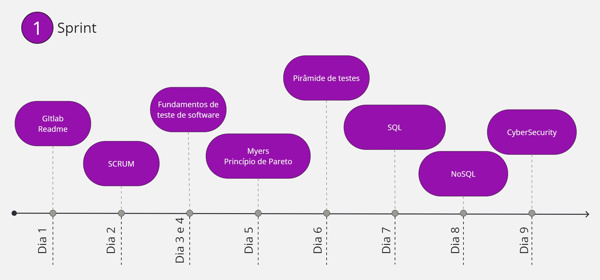

# Processos Ágeis e Fundamentos de Teste

## Sobre o projeto

Na primeira sprint, foi solicitado que adquirissemos conhecimento nas seguintes áreas:

* [Git, gitlab e readme](Resumos/Dia%201/Gitlab.md)
* [Scrum](Resumos/Dia%202/Scrum.md)
* [Fundamentos de testes](Resumos/Dia%203%20e%204/Fundamentos%20de%20teste%20de%20software.md)
* [Myers](Resumos/Dia%205/Myers.md)
* [Princípio de Pareto](Resumos/Dia%205/Principio%20de%20pareto.md)
* [Pirâmide de testes](Resumos/Dia%206/Piramide%20de%20teste.md)
* [SQL](Resumos/Dia%207/SQL.md)
* [NoSQL](Resumos/Dia%208/NOSQL.md)
* [Cybersecurity](Resumos/Dia%209/CyberSecurity.md)

Com esses conhecimentos, iremos ter uma base para todo o andamento da bolsa.

## Mapa da primeira sprint

