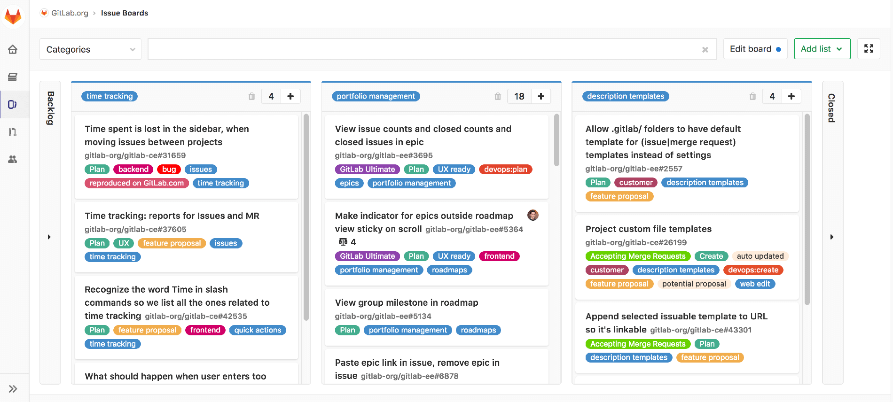
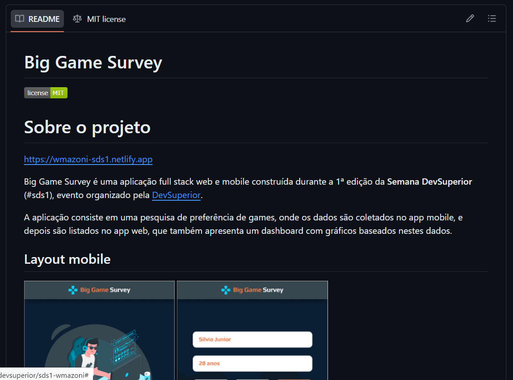

# Gitlab 

Explorei o GitLab, criei uma conta e um projeto para nossa primeira sprint. Descobri que o gitlab tem diversas funionalidades interessantes, como *"Issues/Boards"*, que se assemelham muito ao fucionamento do trello, servindo para ter maior controle do andamento do projeto.

**Boards:**

**Comandos git:**

### Readme
Enquanto estudava o GitLab, aprendi mais sobre o **README**, um arquivo importante que me fez perceber como ele pode ser personalizado.

O **README** permite adicionar conteúdos como fotos, *links* e até mesmo letras de tamanhos diferentes. Também dá para colocar *certificados legais* e outras informações úteis para ajudar quem usa ou trabalha no projeto.

**Exemplo:**

Essas descobertas me mostraram o quanto o **README** pode ser útil, deixando as informações organizadas, fáceis de entender e até bonitas de ver.