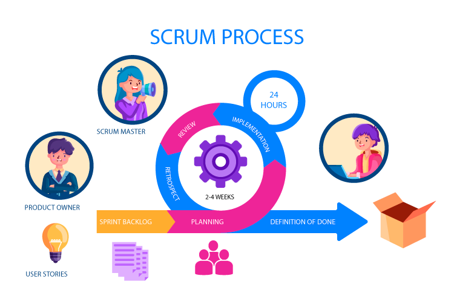

# Scrum
Scrum é um framework ágil para gerenciamento de projetos que ajuda as equipes a trabalhar juntas de forma mais eficiente e eficaz. Ele é baseado na ideia de ciclos iterativos de desenvolvimento, chamados sprints, que normalmente duram de duas a quatro semanas.

**Princípios do Scrum:**

* **Transparência:** Todos os aspectos do projeto são visíveis para todos os membros da equipe.
* **Inspeção:** O progresso é inspecionado regularmente para identificar áreas de melhoria.
* **Adaptação:** O projeto é adaptado conforme necessário para atender às necessidades das partes interessadas.

**Funções do Scrum:**

* **Product Owner:** Representa os interesses das partes interessadas e define a visão do produto.
* **Scrum Master:** Facilita a equipe e garante que o processo Scrum seja seguido.
* **Equipe de Desenvolvimento:** Responsável por desenvolver o produto.

**Cerimônias do Scrum:**

* **Sprint Planning:** A equipe planeja o próximo sprint, incluindo as metas e as tarefas a serem concluídas.
* **Daily Scrum:** A equipe se reúne diariamente para discutir o progresso, identificar obstáculos e planejar o próximo dia.
* **Sprint Review:** A equipe demonstra o trabalho concluído no sprint para as partes interessadas e coleta feedback.
* **Sprint Retrospective:** A equipe reflete sobre o sprint e identifica áreas de melhoria.

**Benefícios do Scrum:**

* **Maior agilidade:** As equipes podem responder rapidamente às mudanças nas necessidades.
* **Maior produtividade:** As equipes são mais focadas e eficientes.
* **Melhor qualidade:** Os produtos são desenvolvidos com maior qualidade devido à inspeção e adaptação regulares.
* **Maior satisfação da equipe:** As equipes são mais engajadas e motivadas.

O Scrum é um framework poderoso que pode ajudar as equipes a trabalhar juntas de forma mais eficaz e entregar produtos de alta qualidade com mais rapidez.