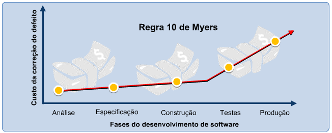

# Regra 10 de Myers

A Regra 10 de Myers é um princípio na engenharia de software que afirma que o custo de corrigir um defeito aumenta exponencialmente quanto mais tarde ele for encontrado no ciclo de desenvolvimento. Isso ocorre porque, à medida que o desenvolvimento avança, mais componentes e dependências são adicionados ao sistema, tornando mais difícil e demorado corrigir defeitos.

