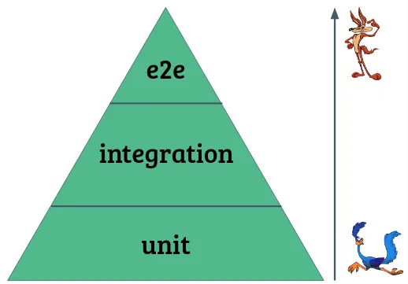
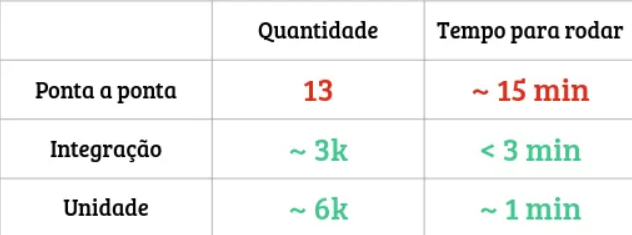

# Pirâmide de teste
A função da pirâmide de testes é basicamente definir níveis de testes e te dar um norte quanto à quantidade de testes que você deveria ter em cada um desses níveis.

## Testes de unidade
Os testes de unidade verificam a menor unidade testável do código, independentemente de suas interações com outras partes do código. A unidade geralmente é um método público em uma classe ou um conjunto de classes/métodos/objetos que interagem entre si.

Para tornar os testes de unidade independentes, são usados "test doubles", que imitam o comportamento de objetos reais, mas de forma mais rápida e determinística. Isso permite que os testes sejam executados rapidamente e isola o problema quando um teste falha.

Os testes de unidade podem guiar o design do código, especialmente quando o Desenvolvimento Orientado a Testes (TDD) é usado, pois o teste atua como o primeiro usuário do código, promovendo simplicidade e coesão.

## Testes de integração
A imagem abaixo demonstra com clareza, como que funciona na prática os testes de integração, a porta funciona perfeitamente, a fechadura funciona perfeitamente, mas a integração entre ambas não aconteceu da maneira esperada.

Testes de unidade são simples e rápidos, mas limitados. Eles testam unidades isoladamente e podem não detectar problemas de integração.

Testes de integração resolvem esse problema ao testar a interação entre várias unidades. Eles são mais complexos e demorados que os testes de unidade, mas mais simples e rápidos que os testes de ponta a ponta.

Testes de integração testam funcionalidades específicas, não o sistema como um todo. Eles são úteis para garantir que as unidades funcionem juntas conforme o esperado.

## Testes de ponta a ponta (E2E)
Os testes E2E simulam o uso real de um sistema, executando ações como abrir navegadores, preencher formulários e clicar em botões. Eles são executados em ambiente controlado e automatizado, diferentemente dos usuários reais.

**Características:**

* **Simulação:** Replica o comportamento do usuário no sistema.
* **Automação:** Executado por robôs em ambiente controlado.
* **Abrangência:** Verifica todo o fluxo do sistema.
* **Complexidade:** Pode ser complexo de escrever e demorado para rodar.
* **Depuração:** Pode ser difícil identificar a origem dos problemas em caso de falha.

**Vantagens:**

* Testa o sistema como um todo.
* Detecta problemas que podem passar despercebidos em outros tipos de teste.

**Desvantagens:**

* Complexidade e tempo de execução elevados.
* Depuração desafiadora.
* Cobertura geralmente limitada aos fluxos principais do sistema.

Os testes E2E são importantes para garantir o funcionamento correto do sistema, mas devem ser usados em conjunto com outros tipos de teste para uma cobertura mais completa.

## Conclusão
* A pirâmide de testes mostra a importância de focar em testes de unidade (base da pirâmide), que são fáceis e rápidos de executar.
* Os testes de integração (meio da pirâmide) cobrem cenários específicos que não são abrangidos por testes de unidade ou ponta a ponta.
* Os testes de ponta a ponta (topo da pirâmide) são mais complexos e demorados, portanto, devem ser usados com moderação.

**Proporção de testes na Creditas:**

* Testes de unidade: maior quantidade, execução mais rápida
* Testes de integração: quantidade menor, execução mais demorada
* Testes de ponta a ponta: menor quantidade ainda, execução mais demorada

